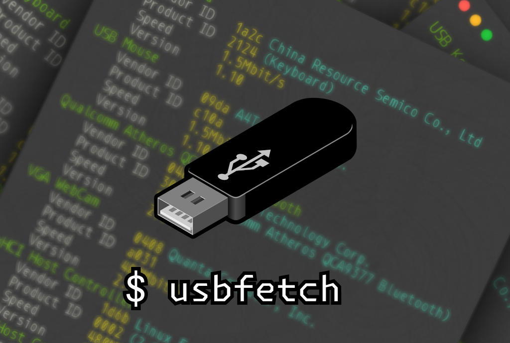
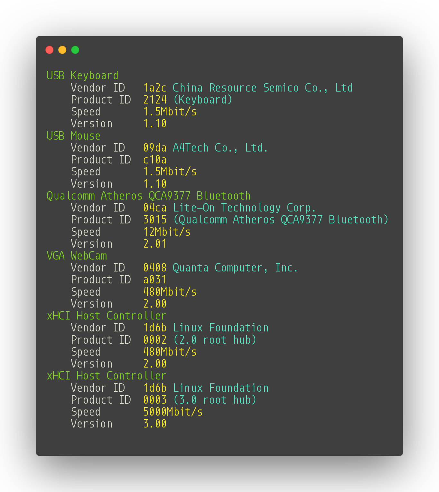

<h1 align="center">usbfetch</h1>

[neofetch](https://github.com/dylanaraps/neofetch) but for USB devices

# 📥 Install & OS Support
`usbfetch` currently only works on Linux. MacOS support is planned.
As of now, you can install `usbfetch` in the following 2 ways:
- If you have Go 1.21+ then run: `go install github.com/furtidev/usbfetch@latest`. The executable will be available in `$GOPATH/bin`.
- If you don't have Go or don't want to bother compiling,  check the [latest release](https://github.com/furtidev/usbfetch/releases/latest). You can download precompiled executables from there. Both `amd64` and `i386` architectures are supported. 

And then run the executable in your terminal.

# ⚖️ License
This project is licensed under the [MIT](./LICENSE) license.
